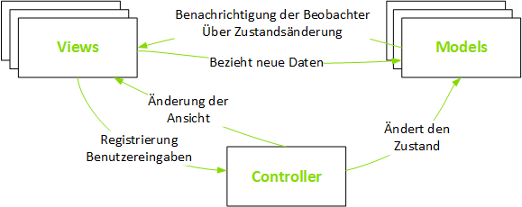
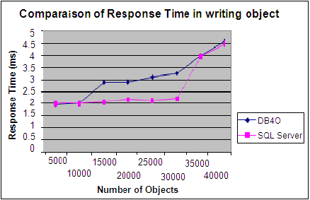
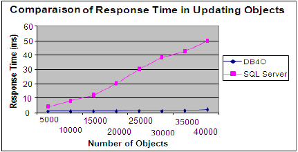

# 4. Gegenüberstellung RDBMS zu OODB

Dieses Kapitel stellt Relationale Datenbanksysteme Objektorientierten Datenbanksystemen gegenüber. Dazu werden essentielle Charakteristiken beider Datenbanksystemansätze verglichen.

## 4.1	Allgemeine Charakteristiken beider Datenbankkonzepte

Um eine Gegenüberstellung beider Datenbanksysteme zu ermöglichen, sollten zunächst die grundlegenden Intentionen hinter der Entwicklung beider Technologien erläutert werden. Relationale Datenbanksysteme (RDBS) wurden konzipiert, um große Datenmengen zu speichern und zu verwalten. RDBS priorisieren einen normierten und konsistenten Datenbestand und berücksichtigen diese Aspekte konsequenterweise als zentrale Entwurfs- respektive Design-Anforderungen. Das RDBS soll mehreren Nutzern den Zugriff auf die Daten ermöglichen und je nach Anforderungsprofil auch die Manipulation der Daten zulassen. Wie bereits im Kapitel 2.1.2 dargelegt, erfolgt die Speicherung der Daten in Tupel, zusammengefasst als eine Relation. Das Relationale Datenbankkonzept existiert seit 1970 und ist demgemäß durch die zu dieser Zeit geltenden Paradigmen und technologischen Rahmenbedingungen geprägt. Insofern wurden mit dem Paradigmenwechsel von der modularen Programmierung zum objektorientierten Entwicklungsansatz Kritikpunkte in der Organisation der Daten als relationale Konstrukte in einem RDBS deutlich.

In der Konsequenz wurden Objektorientierte Datenbanksysteme entwickelt, um die Anforderungen einer  objektorientierten Programmierung (OOP) im Konzept grundlegend zu berücksichtigen und die ursprünglich vorhandenen Defizite der Datenspeicherung in einer relationale Datenbank zu kompensieren. RDBS in der ursprünglichen Funktionskonzeption können nur simple Datenstrukturen abbilden. Dieser Umstand zwingt Entwickler von objektorientiertem Quellcode, einen entsprechenden Adaptionsaufwand zu betreiben, um komplexe Klassenattribute in die gegebenen simplen Datentypen eines RDBS abzubilden. Dies trifft gleichermaßen auf die Umsetzung von Operationen zu, die auf die verfügbaren Datenbankoperationen umgesetzt werden, was in einer zunehmenden Komplexität des Quellcodes resultiert. Infolgedessen adressieren OODBS dieses Manko und bieten hierfür eine alternative Umsetzung. (vgl. @obasanjo2003exploration S. 3)

Unabhängig von den unterschiedlichen konzeptionellen Ansätzen beider DBS, gibt es auch eine Schnittmenge an Eigenschaften, die gleichermaßen auf beide Systeme zutreffen. Beide Kategorien von Management-Systemen realisieren die folgenden Funktionalitäten:

  *	Speicherung der Daten nach einem Schema
  *	Bereitstellung von Modulen bzw. Mechanismen zur Wartung der Datenbanken
  *	Realisierung einer persistenten Datenspeicherung (auch nach einem Recovery-Szenario)
  *	Umsetzung eines Multiuserzugriffs
  *	Transaktionsmanagement
  *	Implementierung einer Abfragesprache zur Selektion oder Manipulation der Daten

(vgl. @obasanjo2003exploration S. 528). Die essentiellen Unterschiede beider Datenbanktechnologien sind im Detail zu eruieren, was der primäre Betrachtungsgegenstand im nachfolgenden Kapitel ist.  

## 4.2	spezifische Unterschiede beider Datenbankkonzepte

Bei einem Vergleich beider DBS besteht ein prägnanter Unterschied im Aspekt der Datenspeicherung. Das RDBS speichert Daten in der Form von Relationen ab, die i.d.R. aus mehreren Tupeln bestehen (siehe Kapitel 2.1.2). OODBS besitzen hingegen eine Datenrepräsentation in der Form von Klassen, die Objekte ausprägen. Der Unterschied liegt hierbei in der zusätzlichen Erfassung des Objektverhaltens, durch die Inkludierung der Methoden. Hierarchien werden im RDBS über Schlüsselbeziehungen zwischen Primär- und Detailtabelle dargestellt, beim OODS wird die Hierarchie über das Prinzip der Vererbung (Generalisierung und Spezialisierung) von Klassen realisiert. Bei der Betrachtung der konkreten Laufzeitbedingungen der Datenelemente weisen Objekte gegenüber den Entitäten erhöht Restriktionen auf. Beispielsweise definieren Klassen über Konstruktoren, wie die Objekte zur Laufzeit ausgestaltet werden sollen. Zunächst existieren zwischen beiden Modellen bei einer allgemeinen Betrachtung Gemeinsamkeiten: So verfügen Relationen und Klassen über Attribute und können Beziehungen untereinander aufbauen. Demgegenüber stehen konzeptbedingte Eigenschaften des objektorientieren Modells, die vollständig beim RDBS fehlen. Exemplarisch seien das Vorhandensein von Interfaces oder die Prinzipien der Kapselung oder Vererbung angeführt. Die eindeutige Identifizierung von Objekten wird beim objektrelationalen Datenmodell über Object Identifier (OID) realisiert. Beim RDBS sind Tupel durch den Primärschlüssel eindeutig gekennzeichnet (siehe Kapitel 2.1.2).

*Abweichung grundlegender Eigenschaften*

Neben den spezifischen Eigenschaften des Modells verzeichnen überdies die Managementsysteme der Datenbanktechnologien signifikante Unterschiede bzw. befolgen aufgrund des angestrebten Einsatzkontextes unterschiedliche Zielestellungen. Das hauptsächliche Anliegen des ODBMS ist eine Datenunabhängigkeit der Objekte voneinander sowie eine Datenkapselung. Dies wird durch die Reflektion des Ansatzes der objektorientierten Programmierung bedingt, indem für ein Objekt Methoden angeboten werden, welche den Zugriff und die Manipulation der Daten zulassen. Beim RDBMS soll eine Entkopplung gegenüber der Geschäftslogik erfolgen. Dies wird vor allem bei der 3-Schichten-Architektur (vgl. Abbildung 3) deutlich, indem das Datenbanksystem als eine eigenständige Komponente ausschließlich die Persistenz realisiert. Ferner existiert in der objektorientierten Programmierung mit dem Model View Controller-Entwurfsmuster (vgl. Abbildung 4) ein Ansatz, der gleichermaßen eine Separation von Daten und Methoden vorsieht und somit eine klare Schnittstelle für einen RDMBS-Einsatz bereitstellt.

Die Kombination der Speicherung von Daten und Methoden bedingt weitere Eigenschaften, die gegenüber dem RDMBS prinzipiell nur auf das ODBMS zugtreffen. Das Prinzip der Kapselung sieht vor, dass Daten ausschließlich durch die für ein Objekt implementierten Methoden geändert werden können. In diesem Kontext spricht man von Objekten, die in einem aktiven Zustand die Möglichkeit besitzen, andere Wertausprägungen der Attribute vorzunehmen. Das Gegenteil besteht bei den RDBMS, wo die Daten ein passives Verhalten aufweisen. Sobald sich die Daten in einer aktiven Nutzungssituation befinden, können jedoch die limitierten Operationen eingesetzt werden. Vollständigkeitshalber sei an diesem Punkt erwähnt, dass die unterschiedliche Handhabung der hierarchischen Datenstrukturen vom DBMS reflektiert werden muss, indem dieses z.B. Join-Operationen ausführt. Dies bedingt wiederum unterschiedliche Performance-Eigenschaften eines DBMS. Das OODBMS verfolgt eine redundanzfreie Speicherung von Methoden. Dieses Ziel wird durch die Kapselung und Vererbung erreicht. Das RDBMS forciert das Ziel einer redundanzfreien Datenspeicherung gleichermaßen. Der Unterschied besteht in der Verortung dieses Ziels. Während beim RDBMS dies durch eine Datennormalisierung angestrebt wird und das Resultat des Datenbankdesigns ist, wird dies beim OODBMS durch die Prinzipien der objektorientierten Programmierung realisiert. Wenn der Aspekt der Performance betrachtet wird, so bedingt die Datenkonstellation (primär die Komplexität und die Anzahl der Datensätze/Tupel) die Geschwindigkeit für den Zugriff auf die Daten. Das Prinzip der gemeinsamen Ablage von Daten und Methoden beim OODBMS offeriert hier Optimierungspotenzial, indem beide Elemente bei einem Zugriff verfügbar sind. Schlussendlich werden bei den Konzeptionsmodellen abermals Differenzen zwischen den Systemen offensichtlich: Das OODBMS nutzt ein einheitliches Modell für die Aspekte der Analyse, des Designs, der Programmierung und des Zugriffs auf die Datenbank. Abermals impliziert die Kombination von Persistenz und Geschäftslogik beim OODMBS eine, gegen dem RDBMS abweichende, Charakteristik: Die Klassen der Objekte repräsentieren das Konzept der via OOP realisierten Applikation. Beim RDBMS finden unterschiedliche Konzeptionsmodelle Anwendung. Das Modell der Daten weicht somit von dem Modell der Analyse, des Designs und der Programmierung ab. Beispielsweise muss das konzeptuelle Datenbankmodell letztendlich in das logische Modell überführt werden, indem eine Abbildung von Entitäten auf Relationen stattfindet. Ein Zugriff erfolgt anschließend mit der dafür vorgesehenen Abfragesprache SQL. (vgl. @gheorghe2007comparison S. 83ff.)

Parallel zu den Konzepten, verfolgen die Sprachkonstrukte beider Systeme unterschiedliche Ansätze zum Zugriff auf die Datenobjekte. SQL ist eine auf relationale Algebra basierende Abfragesprache, die einen reduzierten Satz an Syntax-Elementen besitzt, um Operationen auf Daten eines RDBMS auszuführen. Darüber hinaus bietet SQL die entsprechenden Methoden, um Relationen und deren Attribute zu verwalten, Nutzer zu erstellen oder Berechtigungen vorzunehmen. Um zumindest Datenoperationen ausführen zu können, muss der Nutzer über die schematische Beschaffenheit der Datenbank bzw. über die Datenobjekte Kenntnisse besitzen. SQL grenzt sich gegenüber herkömmlichen Programmiersprachen ab, indem z.B. Operationen auf der Ebene einer Tabelle erfolgen. Zieht man einen Vergleich zum OOBMS, wird abermals ein gravierender Unterschied deutlich: Die objektorientierte Datenspeicherung sieht eine objektbezogene Zuordnung von Methoden zu Objekten vor. In der Betrachtung des Zugriffs auf die Methoden, ist dadurch weniger Quelltext erforderlich. Es wird eine Modularisierung bzw. Wiederverwendbarkeit von Quelltext gefördert, was als Vorteil zu bewerten ist. (vgl. @buetuener2012advantages S. 4).

*Objektrelationale Datenbank Management Systeme*

Gegenüber den o.g. Datenbankmanagementsystemen existieren Objektrelationale Datenbank Management Systeme (ORDBMS), welche die Produktattribute der RDBMS und OODMS kombinieren. Dadurch sollen bestimmte Defizite einer ausschließlichen Nutzung eines RDBMS kompensiert werden, indem z.B. der Vorrat an einfachen Datentypen durch die Möglichkeit erweitert wird, komplexe Datentypen zu definieren. Die komplexen Datentypen lassen sich hierbei über Typenkonstruktoren zusammensetzen. Diese können wiederum von Tabellen als Datentypen genutzt werden. Überdies können ORDBMS Funktionen aufnehmen, die wiederum komplexe Datentypen als Parameter verwenden können. Das Konstrukt der Informationsvernetzung zwischen den Tabellen durch Referenzen (Verweise auf Tupel) eröffnen hierarchische Datenstrukturen ohne Join-Operationen. Jedoch beschränkt sich das Konzept eines ORDBMS nicht ausschließlich auf die diese Charakteristiken. Vielmehr fassen ORDBMS weitere Produkteigenschaften eines OODBMS in die Speicherstruktur eines RDBMS (vgl. @mahnke2000ordbms):

  * Vererbung, Vererbungshierarchien und Polymorphie
  * Regeln (erweitertes Konzept zum RDBMS)
  * Zugriff auf externe Daten
  * Einsatz als Integrationsplattform
  * Plug-Ins

In der Praxis ist es mittlerweile üblich, dass renommierte und am Markt etablierte Datenbankhersteller wie z.B. Oracle[^oracle] ihre Technologien nicht ausschließlich auf den relationalen Datenbankansatz ausrichten. Datenbanksysteme der Version 11g oder 12c können objektrelationale Daten speichern und bieten folglich mehr Möglichkeiten für eine Abbildung der Persistenz der Anwendungen oder Software-Systeme.  
Wie dieses Kapitel darlegt, kann durch das Vergleichen der Spezifik beider Konzepte keine als generell vorteilig oder nachteilig eingestuft werden, was ein Konzept klar prädestinieren würde.  

## 4.3	Vor und Nachteile beider Konzepte

Eine direkte Gegenüberstellung der Datenbanktechnologien erscheint angesichts der unterschiedlichen Ausrichtungen auf die dialektischen Entwicklungsansätze schwierig (siehe 4.2). Dies äußert sich in den unterschiedlichen Einsatzgebieten der Datenbankmanagementsysteme. Aus dieser Begründung heraus fokussiert dieses Kapitel Aspekte, die eine Abwägung der Vor- und Nachteile zulassen, um einen Erklärungsansatz für die Verbreitung der unterschiedlichen Datenbanktechnologien zu liefern.

**Modellierung**

Zunächst sind die pragmatisch gelagerten Aspekte beider Technologien gegenüberzustellen. Die Präferenz eines DBS ist unmittelbar vom eigentlichen Anwendungsszenario abhängig und somit auch die Beurteilung der Vor- und Nachteile. Während RDBMS für die Verwaltung großer Datenmengen prädestiniert erscheinen, eignen sich OODMS insbesondere bei modernen Programmierparadigmen. Abstrahiert man beide Systeme von dieser Betrachtung, besitzt das OODMS hinsichtlich der Datenmodellierung eine höhere Flexibilität. Der relationale Ansatz gilt gegenüber der objekt-orientierten Speicherung von Daten als aufwändiger, da eine Datenrepräsentation auf das Modell von Relationen umgesetzt und mittels der dafür spezifischen Sprache SQL syntaktisch unterlegt und verwaltet werden muss. Dazu sind die Daten durch Normalisierungsregeln den Ansprüchen einer redundanzfreien Speicherung umzuwandeln. Folglich kann die reale Welt schwieriger abgebildet werden, da relationale Modellierung nur bedingt mit den gegebenen Möglichkeiten die oftmals vorherrschende Komplexität der Objektekonstellationen umgehen kann. OODBS können demgegenüber auf die Klassendefinitionen zurückgreifen. Das Schema eines OODBS kommt der einsatzbezogenen Charakteristik der Anwendung entgegen, was als Vorteil zu werten ist. Auch ist man in der Modellierung konkreter Objekte klar an die Restriktionen des RDMBS gebunden, was dialektisch dazu, dem OODB gestalterisch mehr Freiräume eröffnet (vgl. @bartels1992genwechsel). Als Beispiel sei hier die persistente Abbildung eines Dokuments genannt, welches aus diversen Teilabschnitten mit eigenen Attributen bestehen kann.

**Performance**

Parallel zu den bereits durch die Konzeption ersichtlichen Unterschieden beider Technologien bedingen Betriebsaspekte über eine vorteilige oder nachteilige Bewertung. Die Performance ist für komplexe Anwendungssysteme ein entscheidender Faktor, bezogen auf die Präferenz eines Systems, um eine flüssiges Nutzungserlebnis der Software zu begünstigen. Eine Beurteilung der Performance für z.B. Lese- und Schreibzugriffe unterschiedlicher Datendimensionen erfordert, die Perspektive einer herstellerspezifischen Abstraktion zu verlassen. Damit ein grundlegender Eindruck der Leistungsfähigkeit beider Technologien gewonnen werden kann, wird auf das Ergebnis eines Performance-Vergleichs der Datenbanksysteme Db4o[^db4o] und SQL Server 2008[^mssql] Bezug genommen. Die Projektgruppe  @saxena2013performance hat essenzielle Aspekte der Lese- und Schreib-Performance einer Datenbank identifiziert und dazu korrespondierende Leistungsermittlungen durchgeführt. Es wurde die Reaktionszeit gemessen, Datenobjekte zu schreiben, abzurufen oder zu ändern. Hierbei wurden die genannten Datenbankoperationen aggregiert nach Testreihen durchgeführt und unterschiedlich viele Datenobjekte abgerufen. Die Abbildung 3 visualisiert die Reaktionszeit für die Schreiboperationen auf eine DB zusammen. Demnach weist DB4O eine höhere Reaktionszeit als der SQL Server auf. Auffällig ist die Zugriffskalierung des SQL Servers bei einer zunehmenden Anzahl an Datenobjekten ab ca. 30.000 Einheiten, welche sich der anfänglich größeren Verzögerung des DB4O-Systems annähert. Dieses Ergebnis lässt keine Schlussfolgerung zu, ob mit einer zunehmenden Anzahl an Datensätzen die Zugriffszeit des SQL Servers höher ist, als bei DB4O. (vgl. @saxena2013performance S. 6ff)  

Ein deutlicheres Resultat zeigt die Abbildung 4 bezugnehmend auf die Reaktionszeit für das Updaten von Objekten: So besitzt der SQL Server bereits beim Ändern von 5000 Objekten schlechtere Zugriffszeiten als das DB4O-System. Der Performance-Unterschied nimmt mit der steigenden Anzahl an Datenobjekten weiter zu, sodass eine eklatante Differenz der Reaktionszeit entsteht. Ein ähnliches Ergebnis notiert die Projektgruppe für das Abrufen von Daten, wobei das RDBMS-System, der SQL-Server, abermals eine höhere Reaktionszeit aufweist. Diese Abhandlung soll keine generellen Konklusionen auf die Leistungsfähigkeit beider Technologien zulassen. Es soll lediglich andeuten, dass die zunächst angenommene bessere Performance eines RDBMS (aufgrund der suggerierten Prädestinenz in der Verwaltung großer Datenbestände) nicht der Realität entspricht und somit als Argument für diese Technologie entfällt. Daraus kann keine klare Präferenz für ein Datenbankkonzept abgeleitet werden, zumal die Leistungsfähigkeit direkt durch die Herstellerspezifik bedingt wird.

Die Gegenüberstellung beider Systeme begründet nicht den Umstand, dass RDBMS eine höhere Verbreitung besitzen als OODBMS. Demnach existieren andere Ursachen und Rahmenbedingungen, welche die Bevorzugung von relationalen Datenbanksystemen begünstigen.
