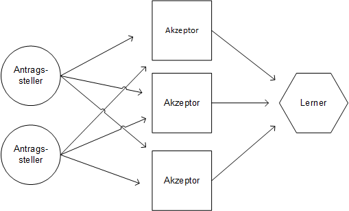

Die Teilnehmer einer Instanz des Paxos Protokolls sind bereits aus 2PC und 3PC bekannt, werden jedoch in spezielle Rollen unterteilt (Abb.2):

# Antragsteller
Ein Teilnehmer übernimmt die Rolle des „Antragstellers“ und ist für die Initiierung des Protokolls zuständig. Nur ein Teilnehmer kann zur gleichen Zeit die Rolle des Antragstellers ausüben. Sollten mehre Teilnehmer diese Rolle für sich beanspruchen, wird das Protokoll solange nicht terminiert, bis nur noch ein Teilnehmer diese Aufgabe übernimmt. 

# Akzeptor
Die anderen Teilnehmer, welche als Kollektiv über vorgeschlagene Werte entscheiden, nennt man „Akzeptor“. Sie sind der fehlertolerante Speicher des Protokolls. Diese Gruppe antwortet auf die Vorschläge des Antragsteller indem sie diese entweder ablehnt oder zustimmt und verspricht dieselbe Antwort auch in der Zukunft zu geben. Diese Versprechen garantieren, dass Vorschläge, die von einem anderen Antragsteller stammen, nicht fälschlicherweise akzeptiert werden und es wird sichergestellt, dass nur die letzten Vorschläge des Antragsteller akzeptiert werden. Jeder Vorschlag an einen Akzeptor wird solange ignoriert, bis die gesamte Gruppe denselben Vorschlag erhalten hat. Sobald die Mehrheit der Akzeptoren einen Vorschlag angenommen hat, kann das Paxos Protokoll beendet werden und der vorgeschlagene Wert wird an die Lerner weitergegeben.

# Lerner
Sobald ein Vorschlag von den Akzeptoren angenommen wurde, wird die Entscheidung an den Lerner weitergeben, welcher dann eine konkrete Aktion ausführt.

  
> Abbildung 2: Antragssteller, Akzeptoren und Lerner Kommunikation

# Quorum
Ein Quorum ist eine Gruppe von Akzeptoren, welche die Sicherheit des Paxos Protokolls sicherstellt, indem die Mitglieder die Ergebnisse der vorangegangenen Entscheidungen speichern. Typischerweise ist ein Quorum eine Mehrheit aller beteiligten Akzeptoren.
So besteht in einer Gruppe mit den Akzeptoren {A,B,C,D} die Mehrheit aus einer Gruppe von drei unterschiedlichen Akzeptoren: {A,B,C}, {A,C,D}, {A,B,D}, {B,C,D}.